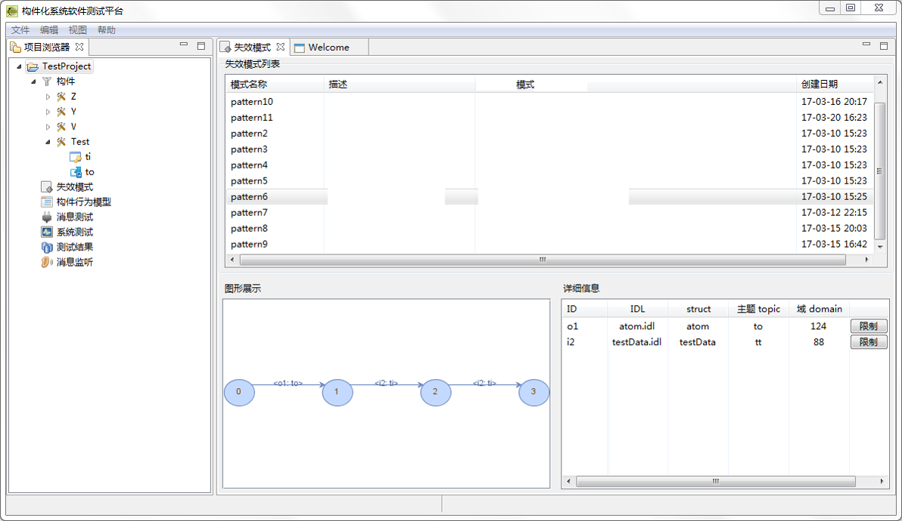
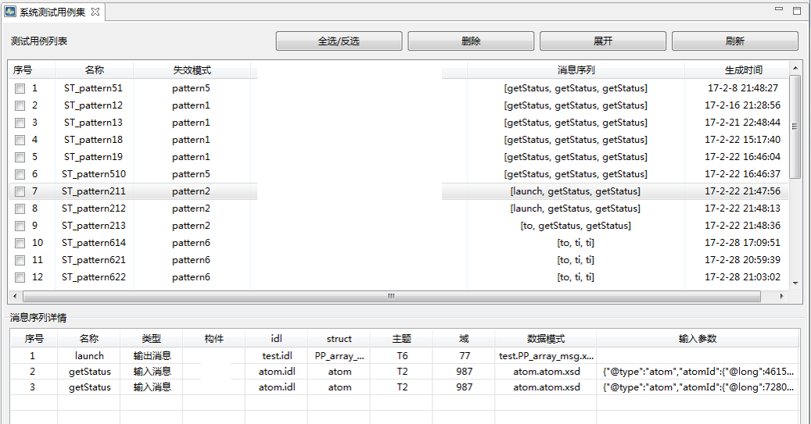

## DdsTest面向DDS通信中间件的测试工具

### 工具说明

DdsTest支持根据IDL接口描述，为DDS通信中间件下的构件自动生成测试用例，并能够自动生成发送DDS报文的数据收发端，进行报文的发送与接收。能够支持国产BlueDCS、RTI等DDS中间件系统。同时该系统还支持基于失效模式描述，进行系统流程级的功能和性能测试。

**主要功能**

* 解析IDL接口描述，并自动构造测试报文。

* 自动生成BlueDCS、RTI DDS下的数据收发端，并进行报文收发，全程全部自动化。

* 基于失效模式进行系统业务流程级的功能和性能测试。 

### 工具界面

