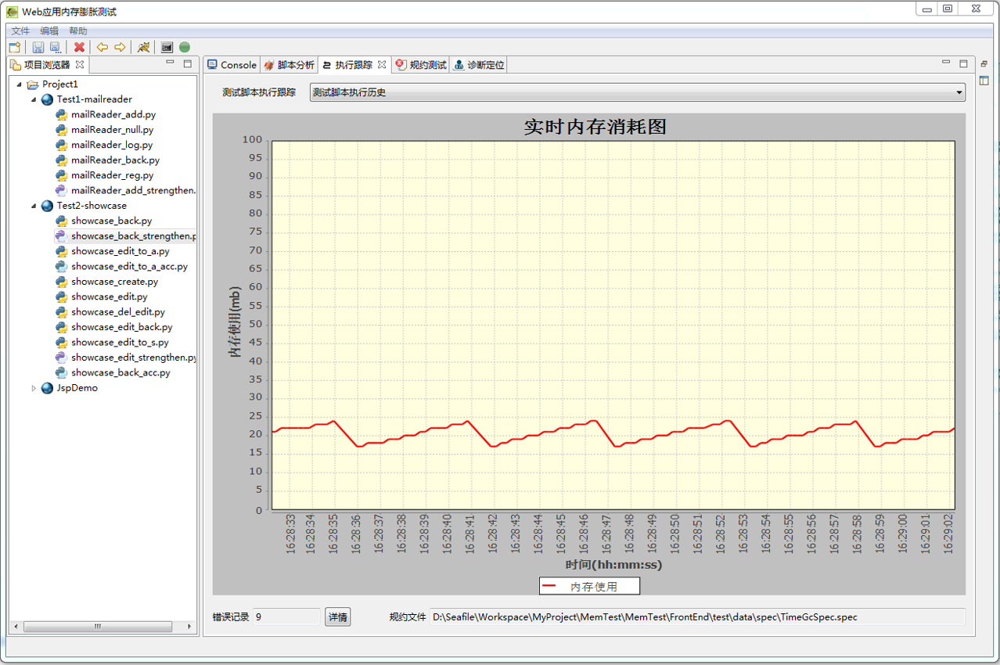
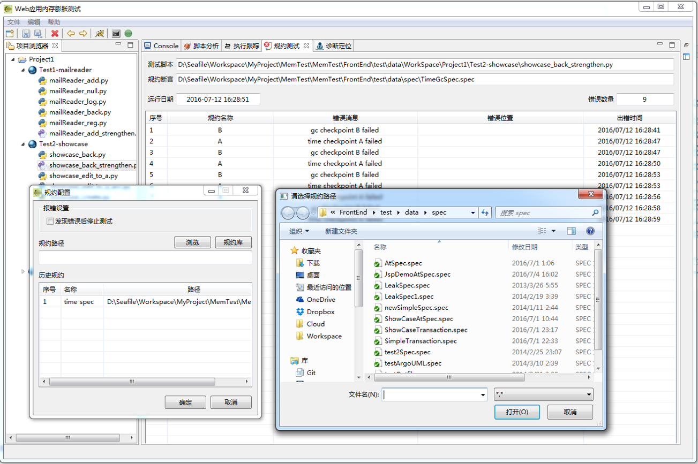
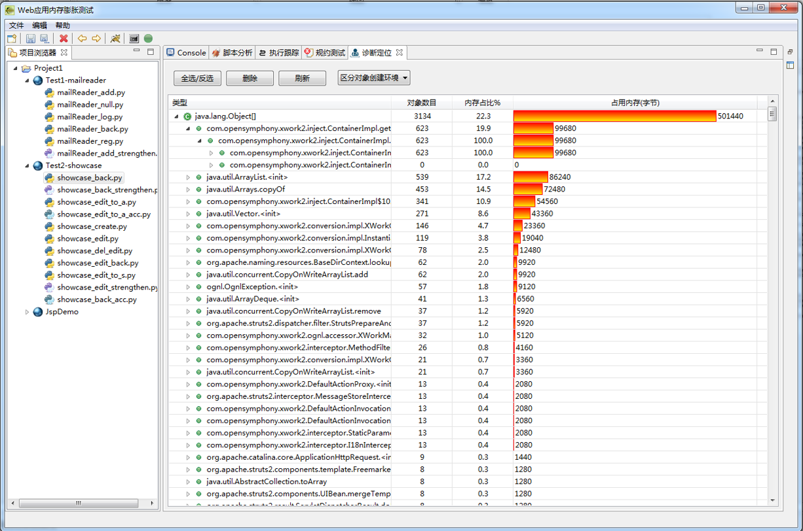

## MemTest内存性能测试工具

### 工具说明

MemTest是一款针对Java Web容器的内存性能测试、跟踪与诊断工具，能够对测试脚本进行分析和变换，自动实施面向内存性能缺陷的测试，能够跟踪Web容器的内存资源使用，对内存性能缺陷进行规约，并能够准确诊断内存泄漏对象。

**主要功能**

* 测试脚本分析与变换：能够面向测试需求，自动对测试脚本进行重构，使之适应内存性能的测试需要。

* 测试执行跟踪：跟踪脚本执行过程中的内存变化情况，并图形化展示。

* 内存性能规约：采用规约语言对内存性能缺陷进行规约，并能够自动判定规约是否得到满足。

* 内存泄漏诊断：采用高精度算法自动针对内存泄漏缺陷的发生位置。

### 工具界面

