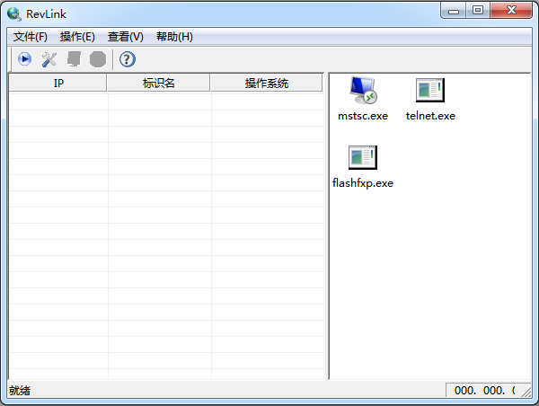

## RevLink内外穿透工具

### 工具说明

RevLink是一款用于穿透校园网等内网的反向代理工具。对于校园网等限制了TCP连接方向和通信协议的网络，利用该工具可以实施网络穿透，进而在校外即可访问校内的远程桌面等服务。
 
下载链接: [[地址]](http://plase.nuaa.edu.cn/jqian/software/RevLink.zip "[地址]")

### 工具界面

 