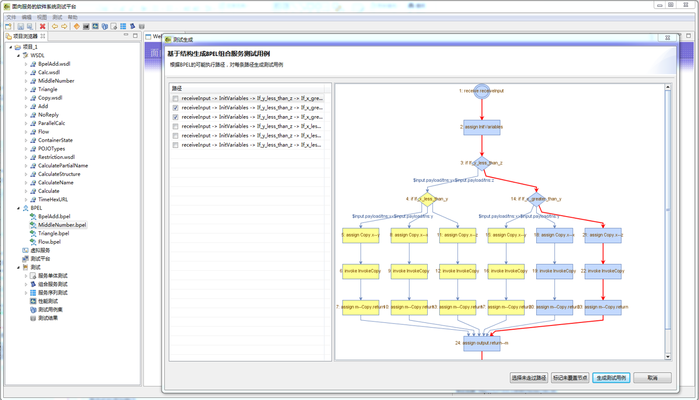

## SOATest服务化软件测试平台

### 工具说明

SOATest是本实验室研发的一款面向Web Service的测试工具，支持SOAP协议下单元服务的测试和BPEL编制下组合服务的测试，利用了最新的测试用例生成算法来自动构造测试数据，能够对Web Service进行全面的功能测试和性能测试。

**主要功能**

* 服务功能测试数据自动生成：支持基于接口规约的黑盒测试用例生成、基于符号执行的白盒组合服务测试生成等测试生成算法。不仅支持基于SOAP协议的传统Web Service，还支持RESTful微服务。

* 测试用例执行和管理：支持收发数据报文、统计测试结果、进度报表导出等功能。支持基于Python的脚本化测试功能。

* 面向场景的性能测试：支持配置性能测试场景、配置运行环境，支持多种结果视图。可实施基于分布式集群的大规模性能测试。

* 故障注入测试：支持注入报文格式故障、通信故障、业务逻辑故障的注入，能够用于模拟较为贴近真实的故障场景。

* 服务虚拟化仿真：支持在只有服务接口描述的情况下，自动为服务构造实现代码，设定服务的业务逻辑和QoS性能指标来Mock一个尚未实现的服务。

* 静态缺陷模式检测：支持对服务描述和报文进行校验

### 工具界面

